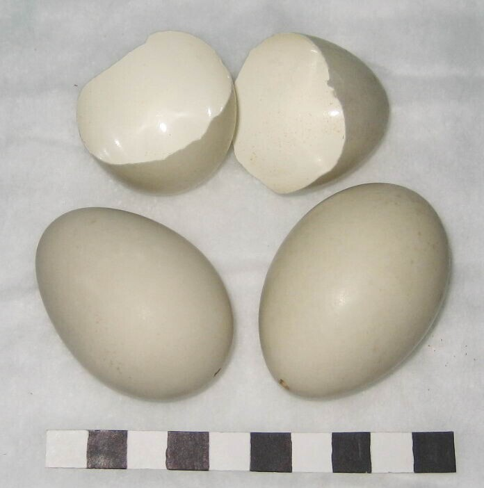
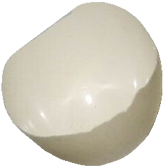
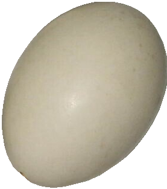
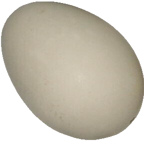

# Global Egg Trait Detection Pipeline

This repository contains a computer vision pipeline for detecting, segmenting, and cropping eggs from biological images using Grounding DINO & SAM2. The software was collaboratively developed during the [2025 FuncaPalooza Workshop](https://github.com/Imageomics/FuncaPalooza-2025/wiki). 

## Overview

The `get_eggs` pipeline processes images to automatically detect and extract egg regions using:
- **Grounding DINO** for object detection with text prompts
- **SAM2 (Segment Anything Model 2)** for precise segmentation
- **Non-Maximum Suppression (NMS)** for filtering overlapping detections

<table width="100%">
  <tr>
    <td align="center" width="50%">
      <h3>Input Image</h3>
      
    </td>
    <td align="center" width="50%">
      <h3>Detected & Cropped Eggs</h3>
      <table>
        <tr>
          <td></td>
          <td></td>
        </tr>
        <tr>
          <td></td>
          <td></td>
        </tr>
      </table>
    </td>
  </tr>
</table>


## Installation

### Prerequisites
- Python 3.8+
- CUDA-compatible GPU (recommended)
- `uv` package manager

### Environment Setup

1. Install uv if you haven't already:
```bash
curl -LsSf https://astral.sh/uv/install.sh | sh
```

2. Create and activate a virtual environment:
```bash
uv venv egg-trait-env
source egg-trait-env/bin/activate  # On Windows: egg-trait-env\Scripts\activate
```

3. Install required packages:
```bash
uv pip install torch torchvision transformers=4.48.3 pillow opencv-python matplotlib pandas pyyaml numpy
```

### SAM2 Installation
You'll need to install SAM2 and download model checkpoints:

1. Clone and install SAM2 (make sure your virtual environment is activated):
```bash
git clone https://github.com/facebookresearch/segment-anything-2.git
cd segment-anything-2
uv pip install -e .
```

2. Download SAM2 checkpoints:
```bash
cd checkpoints && \
./download_ckpts.sh && \
cd ..
```

## Usage

### Basic Usage

Run the pipeline with a CSV file containing image metadata and a YAML configuration file:

```bash
python src/get_eggs.py input_data.csv config.yml
```

### Input Format

#### 1. Input CSV File
Your input CSV must contain image metadata with the following required columns:

- `image_path` (or custom column name): Path to the image file
- `uuid`: Unique identifier for each image
- Additional metadata columns (preserved in output)

**Example CSV structure:**

| observation_id | scientific_name | uri | uuid | filename | latitude | longitude | image_path |
|---|---|---|---|---|---|---|---|
| 6205 | Zenaida macroura | https://example.com/image.jpg | 6dd770ce-137f-4a5f-9015-b185412fd413 | image.jpg | 36.80 | -76.09 | /path/to/image.jpg |
| 6440 | Turdus migratorius | https://example.com/image2.jpg | d7ab7302-7f60-4a93-8a65-d5a5c95e398e | image2.jpg | 36.80 | -76.09 | /path/to/image2.jpg |

#### 2. Configuration YAML File
Create a YAML configuration file to specify model paths and processing parameters:

```yaml
# Required: Column name containing image file paths
filepath_col: "image_path"

# Required: Text prompt for object detection (what to look for)
text_prompt: "egg."

# Required: Path to SAM2 model checkpoint
sam2_checkpoint: "/path/to/sam2.1_hiera_large.pt"

# Required: SAM2 model configuration file
model_cfg: "configs/sam2.1/sam2.1_hiera_l.yaml"

# Optional: Output directory for crops and results
output_dir: "./output"

# Optional: Path for output CSV file with crop information
output_csv: "./output/results.csv"

# Optional: Device to use for inference
device: "cuda"  # or "cpu"

# Optional: Enable visualization of detections
visualize: false

# Optional: Path to save COCO JSON detection results
coco_json_path: "./output/detections.json"
```
### Output

The pipeline generates:

1. **Cropped Images**: Individual egg crops saved as PNG files in the output directory
   - Naming convention: `crop_{uuid}_{crop_index}.png`

2. **Results CSV**: Enhanced metadata file with crop information
   - Contains all original metadata columns
   - Adds `crop_path` column with path to each detected egg crop
   - One row per detected egg (images may have multiple rows if multiple eggs detected)

**Example output CSV:**

| observation_id | scientific_name | uuid | latitude | longitude | crop_path |
|---|---|---|---|---|---|
| 6205 | Zenaida macroura | 6dd770ce-137f-4a5f-9015-b185412fd413 | 36.80 | -76.09 | ./output/crop_6dd770ce-137f-4a5f-9015-b185412fd413_0.png |
| 6205 | Zenaida macroura | 6dd770ce-137f-4a5f-9015-b185412fd413 | 36.80 | -76.09 | ./output/crop_6dd770ce-137f-4a5f-9015-b185412fd413_1.png |

## Pipeline Components

- `get_eggs.py` - Main pipeline script
- `detect_segment_crop.py` - Core detection and segmentation functions
- `sam_utils.py` - SAM2 utility functions
- `visualize.py` - Visualization helpers
- `egg.yml` - Example configuration file

## Data Acknowledgements

The sample image `imgs/egg_example.png` was sourced from [GBIF Occurrence 3357524680](https://www.gbif.org/occurrence/3357524680). 

* **Rights Holder / Creator:** Museon-Omniversum
* **License:** [CC BY-NC 4.0](http://creativecommons.org/licenses/by-nc/4.0/)
* **Institution Code:** MUDH (Museon-Omniversum)

> **Citation:** Kockelkorn H, Creuwels J (2025). Museon Aves Collection. Version 1.9. Museon. Occurrence dataset https://doi.org/10.15468/8dxwmu accessed via GBIF.org on 2025-08-19. https://www.gbif.org/occurrence/3357524680.

**This is a code repository. It does NOT re-distribute any image data.** `metadata_geo_elev.csv` contains the image URI and MD5 hash that could be used for image download from source. We recommend using the [cautious-robot package](https://github.com/Imageomics/cautious-robot) to download the images with verification. Install the package and set your path to the CSV and desired image location using the code below:

```bash
pip install cautious-robot
cautious-robot -i path/to/metadata_geo_elev.csv -o path/to/images -u uri -v md5
```

This will download all images to the desired location, using the filenames provided in the CSV, then verify the completeness of the download based on the provided hashsums.

